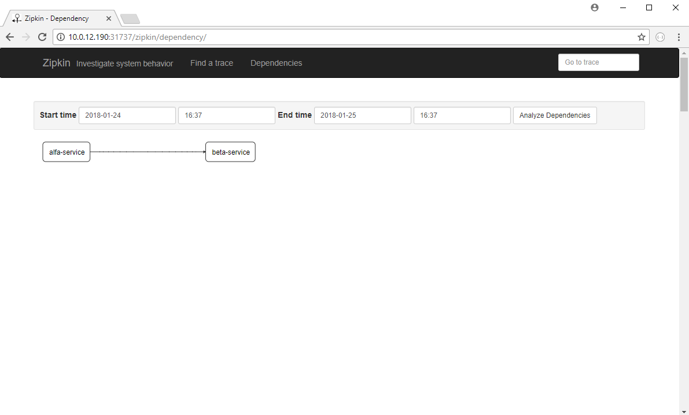
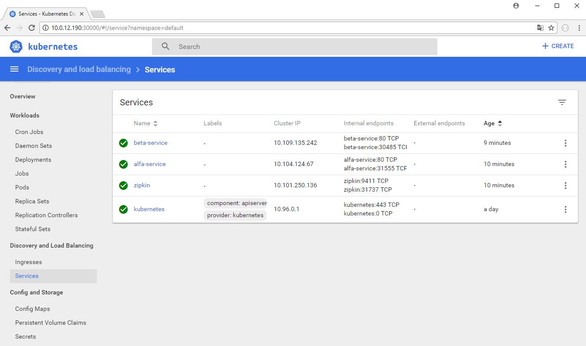
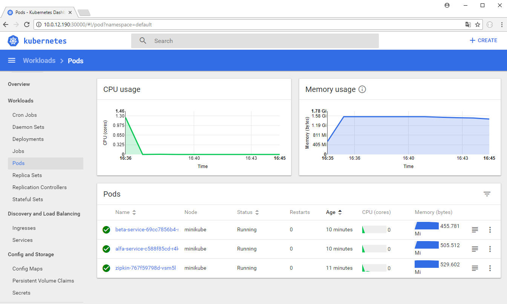

# Kubernetes deployment

## Prerequests

Make sure the following softwares were installed:

- [Docker Community Edition](https://www.docker.com/community-edition)
- [Minikube](https://github.com/kubernetes/minikube) - Local claster with one node (Add to the PATH env variable)
- [Kubectl](https://kubernetes.io/docs/tasks/tools/install-kubectl/) - CLI for kubernetes components management (Add to the PATH env variable)


**Installing Minikube on VirtalBox**

Download and install VirtualBox from
https://www.virtualbox.org/wiki/Downloads
Create VM by changing the vm-driver parameter to virtualbox
- `minikube start --cpus 3 --memory 4096 --vm-driver virtualbox`

Side note on IP address: In order to run minikube in NAT you need to use VirtualBox instead of Hyper-V (Hyper-V virtual switch IP will be your COMPANY IP.)

**Installing Minikube on Hiper-V**

In order to configure Minikube with Hyper-V you can find some help on [this](https://kb.epam.com/display/CTOOCC/Kubernetes+installation) page.

Two points are required before you can start minikube:

1. Create an External Virtual Network Switch in Hyper-V called `minikube` (find instructions through the link above)
2. When you start minikube at first make sure to execute the following command through Git Bash or CMD in administrator mode
- `minikube start --cpus 3 --memory 4096 --vm-driver hyperv --hyperv-virtual-switch minikube` - This can take a while (5-10 minutes) be patient

## Deployment

- Open a Git Bash in administrator mode.
- `minikube status` - you should see something similar:
```
minikube: Running
cluster: Running
kubectl: Correctly Configured: pointing to minikube-vm at 10.0.12.190
```

- If you don't have a running minikube (but you already configured Hyper-V, this is important) cluster than hit `minikube start`.
- `minikube dashboard` - Opens a kubernetes dashboard in your default browser.

- Handy commands are the followings.
- `kubectl describe nodes`
- `kubectl get pods`
- `kubectl describe pod #pod_name`
- `kubectl delete pod #pod_name` - In order to make Minikube reload the pod with an updated Docker image based on the scale defined in the deployment.

- Navigate to the project in Git Bash.
- Make sure you've already built the project by `gradle build`.
- Configure minikube to use your local docker registry by `eval $(minikube docker-env)`.
- Build service images:
 - `cd services/alfa-service`
 - `docker image build . -t alfa-service`
 - `cd ../beta-service`
 - `docker image build . -t beta-service`
- Create kubernetes deployments and services:
 - `cd ../../deployment`
 - `kubectl apply -f zipkin-server.yaml`
 - `kubectl apply -f postgres-server.yaml`
 - `kubectl apply -f alfa-service.yaml`
 - `kubectl apply -f beta-service.yaml`
- Expose `Zipkin` server
 - `minikube service zipkin`
- Expose alfa-service `minikube service alfa-service`. A new browser window will open with an error, but don't worry.
- Navigate to the `/alfa` endpoint. You should see a json  result like:

```json
[
  {
    "alfaId": null,
    "title": null,
    "academicTitle": null,
    "firstName": null,
    "lastName": null,
    "firm": null,
    "alfaInfo": null,
    "country": null,
    "city": "City",
    "zipCode": null,
    "street": null,
    "number": null,
    "standard": null
  }
]
```

- Check `Zipkin`'s `Dependencies` menu. You should see something similar.



- Check `Kubernes`'s dashboard. Notice the created services and pods:





## Performance monitoring

Optionally you can add performance monitoring with Prometheus and Grafana to Kubernetes. This is for local purposes only, e.g. not persistent volume.

The following steps are detailed in the following [tutorial](https://github.com/bakins/minikube-prometheus-demo)

- First, create the monitoring namespace: `kubectl apply -f monitoring-namespace.yaml`
- Deploy Prometheus config by running: `kubectl apply -f prometheus-config.yaml`. Check with `kubectl get configmap --namespace=monitoring prometheus-config -o yaml`
- Create Prometheus deployment by running: `kubectl apply -f prometheus-deployment.yaml`. Check with `kubectl get deployments --namespace=monitoring`
- Create Prometheus service by running: `kubectl apply -f prometheus-service.yaml`. Check with `kubectl get services --namespace=monitoring prometheus -o yaml`

Open Prometheus in a browser exposed: `minikube service --namespace=monitoring prometheus`

- Installing Grafana in similar steps, run: `kubectl apply -f grafana-deployment.yaml` and `kubectl apply -f grafana-service.yaml`

Open Grafana in a browser exposed: `minikube service --namespace=monitoring grafana`. Default username and pwd is `admin`

### Basic config

Lets add it as of Prometheus

- Click on the icon in the upper left of grafana and go to "Data Sources".
- Click "Add data source".
- For name, just use "prometheus"
- Select "Prometheus" as the type
- For the URL, we will actual use Kubernetes DNS service discovery. So, just enter http://prometheus:9090. This means that grafana will lookup the prometheus service running in the same namespace as it on port 9090.
- Create a New dashboard by clicking on the upper-left icon and selecting Dashboard->New. Click the green control and add a graph panel. Under metrics, select "prometheus" as the datasource. For the query, use sum(container_memory_usage_bytes) by (pod_name). Click save. This graphs the memory used per pod.

Run `kubectl apply -f node-exporter-daemonset.yml` to create the daemon set.
To cleanup, you can delete the entire monitoring namespace `kubectl delete namespace monitoring`
